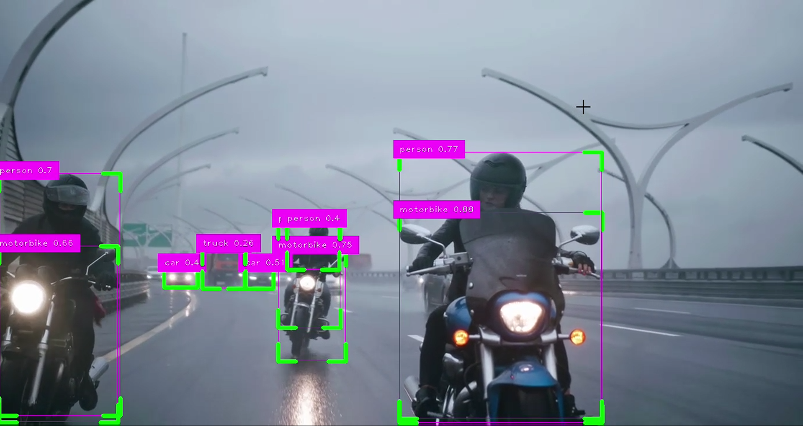
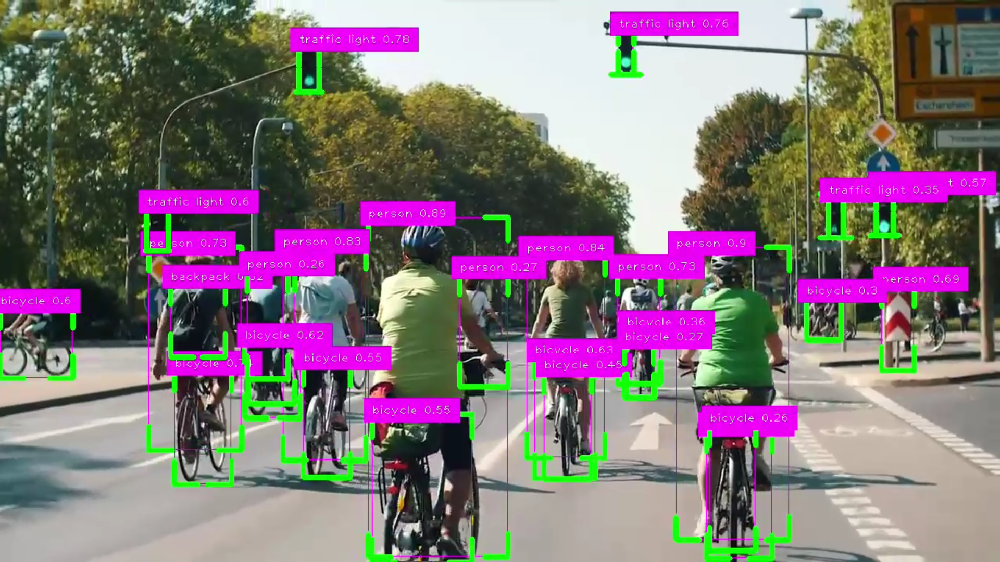
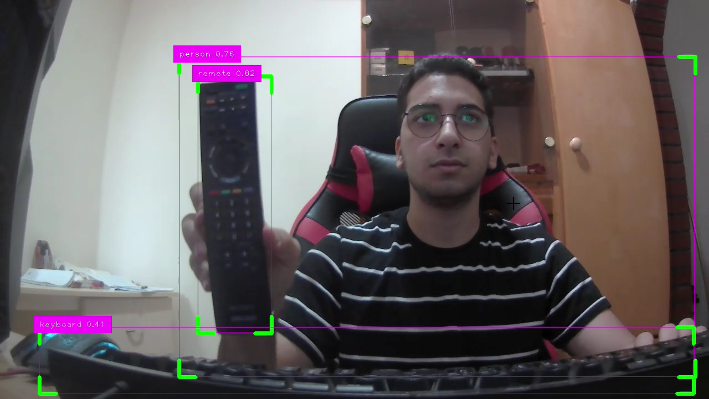
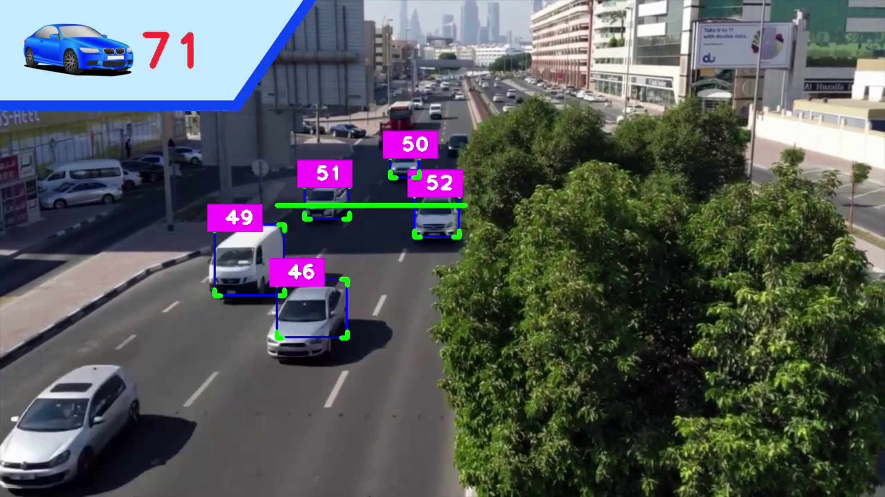
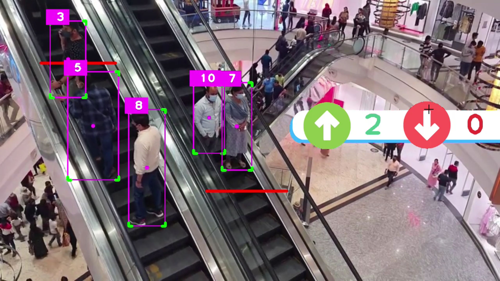
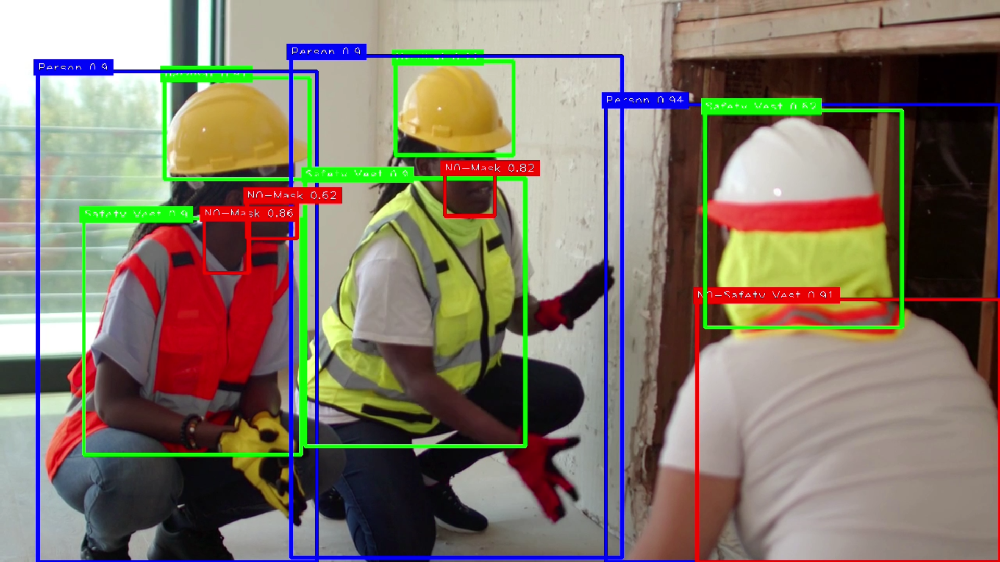

---

# DetectMaster YOLO: Comprehensive Object Detection with YOLO

Welcome to DetectMaster YOLO, a comprehensive project for object detection using the YOLO (You Only Look Once) algorithm. This repository contains various scripts to detect objects in real-time using a webcam, count cars and people, and detect personal protective equipment (PPE).

## Table of Contents

- [Introduction](#introduction)
- [Features](#features)
- [Installation](#installation)
- [Usage](#usage)
- [Scripts](#scripts)
  - [YOLO Webcam Detection](#yolo-webcam-detection)
  - [Car Counter](#car-counter)
  - [People Counter](#people-counter)
  - [PPE Detection](#ppe-detection)
- [Contributing](#contributing)
- [License](#license)

## Introduction
<div style="text-align: center;">
    
</div>

DetectMaster YOLO leverages the power of YOLO for real-time object detection. YOLO is a state-of-the-art, real-time object detection system that can identify multiple objects in a single frame with high accuracy. This project demonstrates the capabilities of YOLO by providing several example scripts for different detection scenarios.

## Features
<div style="text-align: center;">
    
</div>

- Real-time object detection using a webcam
- Vehicle counting for traffic analysis
- People counting for crowd management
- PPE detection for safety compliance

## Installation

1. Clone the repository:
   ```bash
   git clone https://github.com/HoomKh/DetectMaster_YOLO.git
   cd DetectMaster_YOLO
   ```

2. Install the required dependencies:
   ```bash
   pip install -r requirements.txt
   ```

3. Download the pre-trained YOLO weights and configuration files from the [official YOLO repository](https://github.com/AlexeyAB/darknet) and place them in the `weights` directory.

## Usage

Each script in this repository serves a different purpose. Follow the instructions for each script to understand how to run them.

## scripts

### YOLO Webcam Detection

<div style="text-align: center;">
    
</div>

This script uses your webcam to perform real-time object detection.

```bash
python Yolo_Webcam.py
```

### Car Counter

<div style="text-align: center;">
    
</div>

This script counts the number of cars passing through a specified area in a video.

```bash
python Car_Counter.py
```

### People Counter

<div style="text-align: center;">
    
</div>

This script counts the number of people passing through a specified area in a video.

```bash
python People_Counter.py
```

### PPE Detection

<div style="text-align: center;">
    
</div>

This script detects the presence of personal protective equipment (PPE) on individuals.

```bash
python PPEDetection.py
```

## Contributing

We welcome contributions to DetectMaster YOLO! If you have any ideas, suggestions, or bug reports, please open an issue or submit a pull request.

1. Fork the repository
2. Create a new branch (`git checkout -b feature-branch`)
3. Commit your changes (`git commit -m 'Add new feature'`)
4. Push to the branch (`git push origin feature-branch`)
5. Open a pull request

## License

This project is licensed under the MIT License. See the [LICENSE](LICENSE) file for details.

---

 
